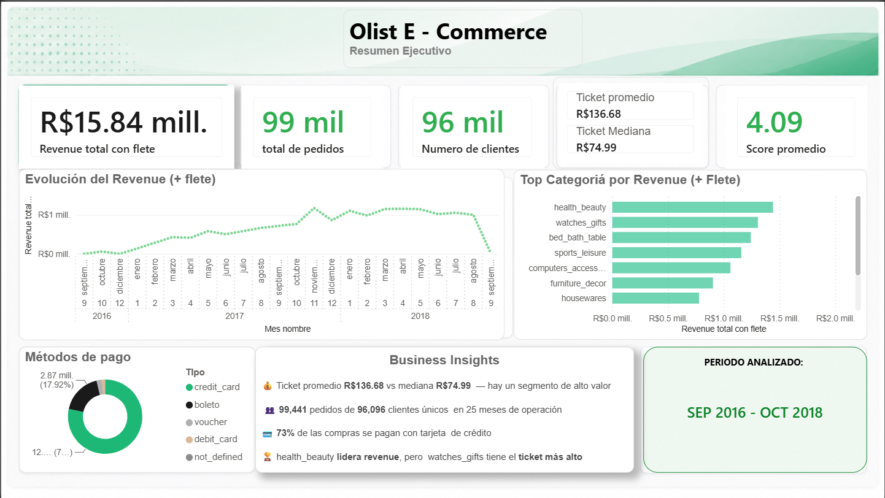
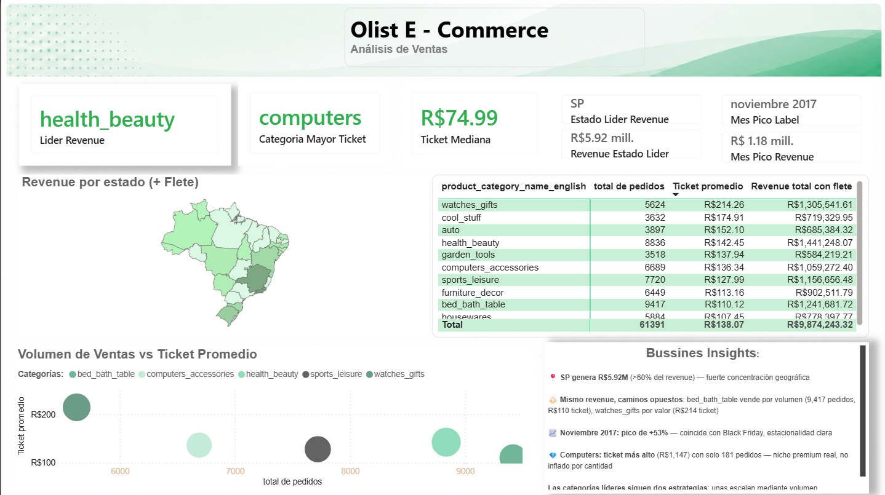
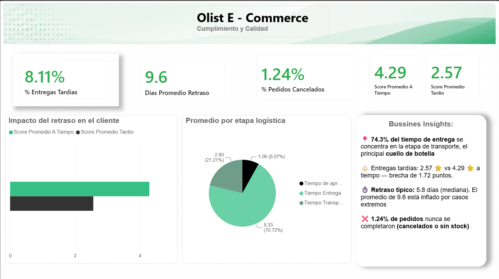
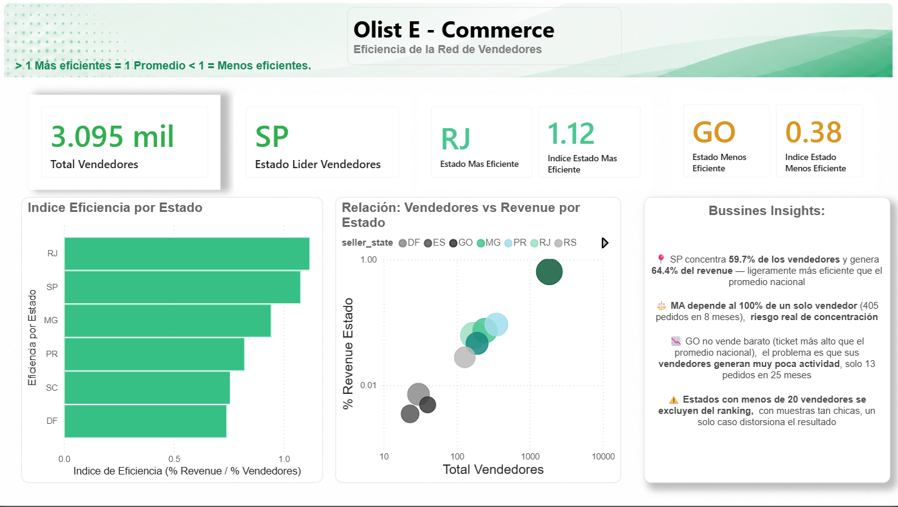
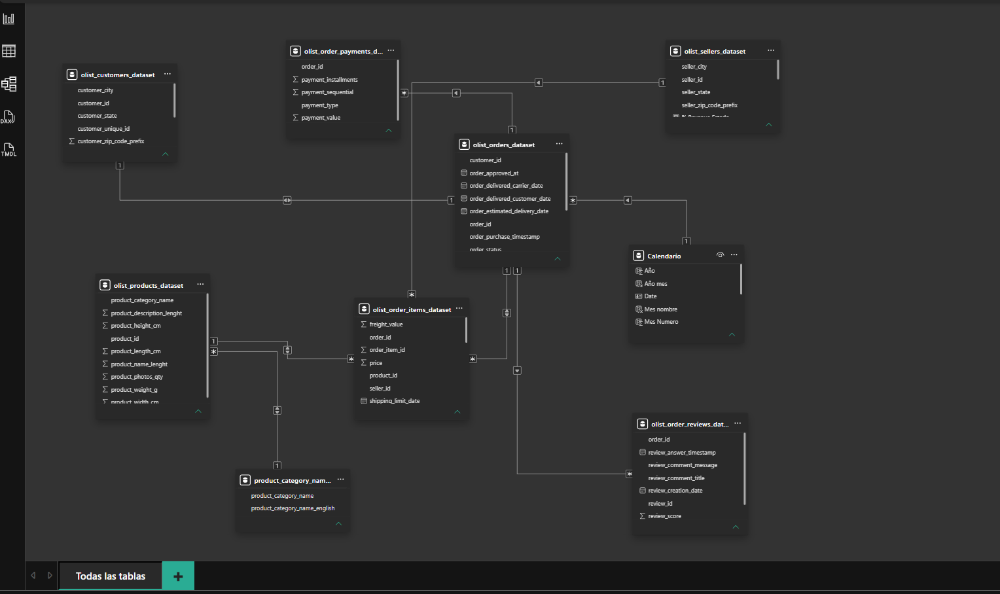

<div align="center">

# Olist E-Commerce
### Business Intelligence Project

*An end-to-end Business Intelligence case study using SQL, Power Query, DAX and Power BI.*



</div>

---

> **TL;DR:** Caso de negocio end-to-end sobre el marketplace Olist (SQL → Power Query → Power BI). Identifica el cuello de botella logístico real (74% del tiempo se concentra en transporte, no en aprobación ni despacho), la brecha de 1.72 puntos en satisfacción entre entregas a tiempo y tardías, y un riesgo de concentración comercial por estado.

## Objetivo

El objetivo de este proyecto fue analizar el desempeño del marketplace brasileño Olist mediante un proceso completo de Business Intelligence, para identificar oportunidades comerciales, logísticas y operativas — desde la exploración cruda de los datos hasta un dashboard ejecutivo de 4 páginas, documentando el razonamiento detrás de cada decisión.

*Nota: este proyecto usa el [Olist Brazilian E-Commerce Public Dataset](https://www.kaggle.com/datasets/olistbr/brazilian-ecommerce) de Kaggle como caso de estudio. El análisis, modelado de datos, medidas DAX y storytelling del dashboard son trabajo propio.*

---

## Business Questions

El dashboard responde 4 preguntas de negocio, en secuencia progresiva.

### ¿Cómo está el negocio?


### ¿Cómo genera dinero?


### ¿Qué tan eficiente es la logística?


### ¿Qué tan eficiente es la red comercial?


---

## Key Business Insights

- **Health & Beauty** lidera el revenue; **Watches & Gifts** tiene el ticket promedio más alto — dos estrategias de venta opuestas (volumen vs. valor) generando revenue comparable.
- El transporte (etapa Transportista → Entrega) concentra **74.3%** del tiempo logístico total — el cuello de botella real del proceso, no la aprobación de pago ni el despacho del vendedor.
- **São Paulo** genera el 64.4% del revenue con el 59.7% de los vendedores — ligeramente por encima de lo proporcional.
- La eficiencia comercial **no depende únicamente del número de vendedores**: Goiás no vende barato (ticket por encima del promedio nacional), su problema es bajo volumen de actividad por vendedor — no valor del producto.
- Los pedidos tardíos caen a 2.57 estrellas de satisfacción vs. 4.29 en los que llegan a tiempo — la correlación más fuerte encontrada en todo el proyecto.

---

## Tecnologías

`PostgreSQL` · `Power Query` · `Power BI` · `DAX` · `Excel`

---

## Arquitectura del proyecto

```
Dataset (Kaggle, 9 tablas)
        ↓
    SQL (EDA, validación cruzada)
        ↓
    Power Query (auditoría de calidad, ETL)
        ↓
    Modelo Estrella (star schema, Power BI)
        ↓
    DAX (~25 medidas)
        ↓
    Dashboard (4 páginas)
        ↓
    Business Insights
```

Principio constante: **SQL-first** — toda medida DAX se valida contra una query SQL equivalente antes de darse por final. Esa disciplina fue la que permitió detectar los dos errores técnicos documentados más abajo.

---

## Documentación

| Documento | Contenido |
|---|---|
| [Diccionario de Datos](docs/diccionario_datos.md) | Estructura de las 9 tablas: columnas, tipos, descripción |
| [Calidad de Datos](docs/calidad_datos.md) | Metodología de auditoría, hallazgos por tabla, decisiones tomadas |
| [Modelo de Datos](docs/modelo_datos.md) | Star schema, relaciones, decisiones de modelado |
| [Medidas DAX](dax/medidas_dax.md) | Librería completa de medidas, con el porqué de cada una |
| [Hallazgos Técnicos](docs/hallazgos_tecnicos.md) | Bugs reales encontrados: causa raíz, diagnóstico, solución |

---

## Data Quality

Auditoría ejecutada con las tres herramientas nativas de Power Query (Column Quality, Distribution, Profile) sobre el **dataset completo**, evaluando 4 dimensiones: Completeness, Uniqueness, Validity, Accuracy.

| Hallazgo | Decisión |
|---|---|
| 610 productos sin categoría (1.85%) | Reemplazados con "unclassified" |
| 551 reseñas duplicadas por order_id | Deduplicado por fecha más reciente (CTE / RELATEDTABLE+VAR) |
| Nulos en fechas de entrega intermedias | Válidos por diseño — pedidos cancelados o en tránsito, no un error |
| Filtro de Power Query dejado activo | Redujo `orders` de 99,441 a 625 filas silenciosamente — detectado por validación cruzada contra SQL |

Detalle completo en [`docs/calidad_datos.md`](docs/calidad_datos.md).

---

## Data Dictionary

9 tablas relacionales — pedidos, items, pagos, reseñas, clientes, productos, vendedores, geolocalización y traducción de categorías. Documentación completa en [`docs/diccionario_datos.md`](docs/diccionario_datos.md).

---

## Data Model

Star schema con `order_items` como tabla de hechos principal, tabla `Calendario` dedicada (`CALENDARAUTO()`) para inteligencia de tiempo.



Detalle completo, incluyendo una corrección de documentación sobre la relación `reviews → orders`, en [`docs/modelo_datos.md`](docs/modelo_datos.md).

---

## SQL

Cada query resuelve una pregunta de negocio específica, organizadas por nivel de análisis en [`/sql`](sql/).

| Query | Qué resuelve |
|---|---|
| `01_nivel1_contexto_negocio.sql` | Tamaño del negocio: volumen, revenue y clientes únicos |
| `02_nivel2_revenue_analisis.sql` | Qué categorías generan más revenue y qué métodos de pago dominan |
| `03_nivel3_calidad_entregas.sql` | Tasa de entregas tardías y tiempo promedio por etapa logística — identifica el cuello de botella |
| `04_vendor_scorecard.sql` | Índice de eficiencia por estado (revenue vs. cantidad de vendedores), con filtro de muestra mínima |

Ejemplo de validación: la query de tiempo por etapa se usó para confirmar, dato por dato, la medida DAX `Tiempo Entrega` antes de darla por buena en el dashboard — ese cruce fue lo que reveló el bug de BLANK vs NULL documentado en Hallazgos Técnicos.

---

## Power Query

- Auditoría de calidad de datos sobre las 9 tablas completas (no solo la muestra de 1,000 filas por default).
- Normalización de tipos de fecha para alinear correctamente con la tabla Calendario.
- Columna calculada `Estado Nombre Completo` — traducción de códigos de 2 letras a nombres completos, requerida porque Power BI Filled Map no reconoce los códigos de estado brasileños (los confunde con estados de EE. UU.).
- Reemplazo de categorías nulas por "unclassified" para que los visuales rendericen sin huecos.

---

## DAX

Librería completa en [`dax/medidas_dax.md`](dax/medidas_dax.md). Las 3 medidas más relevantes:

**`Revenue Total con flete`** — métrica base de tamaño del negocio. Existe separada de `Revenue Total` (solo producto) porque distintas preguntas de negocio requieren distinto denominador: análisis por categoría/vendedor usa solo producto; el revenue "oficial" de la empresa incluye flete.

**`Tiempo Entrega`** — días promedio entre que el transportista recibe el pedido y lo entrega al cliente. Es la medida que reveló el cuello de botella del proyecto (74.3% del ciclo total), y la que expuso el bug de BLANK vs NULL en DAX — requiere excluir explícitamente valores en blanco con `ISBLANK()`, algo que SQL hace automáticamente pero DAX no.

**`Indice Eficiencia`** — `% revenue del estado ÷ % vendedores del estado`. Existe para responder si el revenue de un estado es proporcional a su cantidad de vendedores, o si hay estados que "rinden más" o "menos" de lo esperado — el benchmark no viene de una fuente externa, se construye a partir de la distribución proporcional esperada.

---

## Dashboard

**Página 1 — Resumen Ejecutivo.** Tamaño del negocio: revenue, pedidos, clientes, score promedio, tendencia mensual y top categorías.

**Página 2 — Análisis de Ventas.** Revenue por categoría y estado, relación volumen vs. ticket promedio, estacionalidad (pico en noviembre 2017 por Black Friday).

> *Decisión de diseño descartada: originalmente se planeó un scatter de 3 variables (pedidos, ticket promedio, revenue como tamaño de burbuja). Se reemplazó por 2 bar charts horizontales simples (volumen y ticket) tras cuestionar si un gerente no técnico entendería un scatter de 3 variables sin explicación adicional — priorizar claridad sobre densidad de información.*

**Página 3 — Cumplimiento y Calidad.** Tasa de entregas tardías, distribución de tiempo por etapa logística, correlación entre puntualidad y satisfacción del cliente.

**Página 4 — Vendor Scorecard.** Distribución de vendedores por estado, índice de eficiencia comercial con umbral de muestra mínima (20 vendedores) para evitar conclusiones sobre casos atípicos.

---

## Archivos

```
├── README.md
├── Olist_Dashboard.pbix          # Archivo real de Power BI
├── sql/                          # 4 queries, una por nivel de análisis
├── dax/medidas_dax.md            # Librería completa de medidas DAX
├── docs/
│   ├── diccionario_datos.md
│   ├── calidad_datos.md
│   ├── modelo_datos.md
│   └── hallazgos_tecnicos.md     # Bugs reales: causa raíz, diagnóstico, solución
└── screenshots/                  # Capturas de las 4 páginas del dashboard
```

> El archivo `Olist_Dashboard.pbix` está incluido en la raíz del repositorio. Todo el razonamiento técnico (SQL, DAX, modelo de datos) está además documentado en detalle en las carpetas de arriba, para quien prefiera revisarlo sin abrir Power BI.

---

## Conclusiones

Durante este proyecto reforcé modelado dimensional, documentación técnica, storytelling de datos y diseño ejecutivo de dashboards, además de profundizar en SQL y DAX aplicados a un caso de negocio real.

El aprendizaje más importante no fue una herramienta específica, sino un hábito: **validar siempre contra una fuente independiente antes de confiar en un resultado.** Los dos hallazgos técnicos más relevantes del proyecto — un filtro de Power Query olvidado y una diferencia de comportamiento entre SQL y DAX frente a valores en blanco — nunca se habrían detectado solo mirando el dashboard. Se hicieron visibles porque cada número tenía un número de SQL equivalente contra el cual compararse.

---

## Contacto

**Juan Demián Bañuelos Minor**
Analista de Datos con background en compras, finanzas y operaciones.

[LinkedIn](https://www.linkedin.com/in/datademianminor) · demianminor@gmail.com

**Dataset:** [Olist Brazilian E-Commerce Public Dataset](https://www.kaggle.com/datasets/olistbr/brazilian-ecommerce) (Kaggle)
